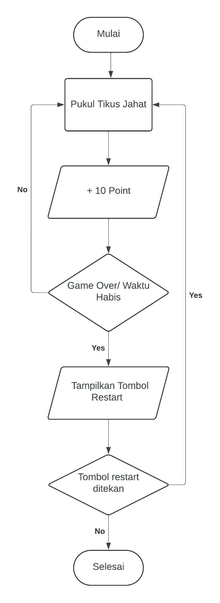

# Calakus 
CATOK PALA TIKUS

- Irfan Zaki Riyanto (102301045) 100%
- Muhammad Fikri Haikal Ariadma (10231063) 100%
- Adonia Azarya T (10231007) 85%
- Rendy Rifandi Kurnia (10231081) 75%
- Chelsy Olivia (10231025) 90%

# Pendahuluan
Seiring dengan perkembangan zaman, industri game juga mengalami perkembangan dari masa ke masa. Telah banyak jenis permainan yang mampu menghibur para pemainnya. Salah satu jenis permainan yang cukup populer adalah permainan dengan genre arcade. Game arcade dikenal dengan gameplaynya yang sederhana namun adiktif, menarik minat pemain dari berbagai kalangan usia. Salah satu game arcade paling terkenal adalah “Whac-A-Mole” yang diperkenalkan pada tahun 1975 di Jepang. Sebuah permainan sederhana dimana pemain diminta untuk memukul tikus-tikus yang muncul secara acak dari lubang-lubang. <a href="#div_ref1">(Wikipedia, 2024)</a>.

Dengan mengadaptasi konsep klasik dari “Whac-A-Mole”, kami mengembang “Calakus: Catuk Pala Tikus”. Game ini mempertahankan konsep dasar dari memukul objek yang muncul tiba-tiba, namun dengan pendekatan yang lebih sederhana. “Calakus: Catuk Pala Tikus” dirancang untuk memberikan pengalaman bermain yang cepat dan menyenangkan. Fokus utama dari game ini adalah pada reaksi cepat dan koordinasi mata-tangan pemain. Selain itu pemain diminta untuk mengumpulkan poin hingga waktu yang telah ditentukan.

Tujuan utama kami dalam membuat game ini adalah untuk memberikan hiburan yang mudah diakses dan menyenangkan bagi semua kalangan. Tidak hanya menghibur tetapi juga dapat melatih refleks pemain. Selain itu kami ingin memberikan suasana nostalgia terhadap game arcade klasik dengan konsep yang lebih modern. Dengan tampilan yang sederhana, "Calakus: Catuk Pala Tikus” dapat menjadi pilihan di sela - sela aktivitas sehari - hari sebagai hiburan ringan bersama orang terdekat.

# Tinjauan Pustaka
Program yang kami buat terinspirasi dari program “Whac-A-Mole” yang diciptakan oleh Kenny Yip Coding <a href="#div_ref2">(Youtube, 2024)</a>. Pada program yang diciptakan oleh Kenny Yip Coding, program akan terus berjalan tanpa adanya waktu pembatas sehingga pemain dapat mengumpulkan poin sebanyak-banyaknya. Sedangkan pada program kami, kami menambah timer sehingga pemain harus mengumpulkan poin sebanyak banyaknya hingga waktu yang telah ditentukan berakhir. Pada program “Whac-A-Mole” buatan Kenny Yip, setelah pemain mengalami game over, pemain hanya dapat melakukan restart pada tombol refresh yang ada pada web browser. Sedangkan pada program kami, kami menambahkan pop up yang akan muncul ketika pemain kalah/habis waktu yang berisi poin akhir serta terdapat tombol restart.

Selain itu kami juga mencari refrensi dari program "Whac-A-Mole" yang diciptakan oleh Angle Brace <a href="#div_ref3">(Youtube, 2022)</a>. Disini kami mencari tahu bagaimana cara untuk membuat kustom kursor dan bagaimana cara ketika suatu tikus dipukul, dia akan berubah gambar.

# Metode Pembuatan
## Inisialisasi Variabel dan Suara:
 * Variabel Tikus jahat dan Tikus baik digunakan untuk melacak lubang mana di mana tikus jahat atau baik muncul.
 * Variabel score digunakan untuk melacak skor pemain.
 * Variabel gameOver menandakan apakah permainan telah berakhir atau belum.
 * Variabel countDown Time digunakan untuk menghitung mundur waktu permainan.
 * Objek sound dan bgSound digunakan untuk memainkan suara saat pemain mengklik  tikus atau saat latar belakang permainan dimulai.
## Penyiapan Permainan:
 * Saat halaman dimuat, fungsi setGame() dipanggil. Fungsi ini mempersiapkan lubang-lubang di papan permainan dan memulai interval untuk munculnya tikus jahat dan baik secara berurutan.
 * Fungsi setInterval() digunakan untuk mengatur interval waktu di mana tikus jahat dan baik muncul.
## Fungsi untuk Memunculkan Tikus:
 * Fungsi TikusJ() dan TikusB() digunakan untuk mengatur munculnya tikus jahat dan baik di lubang secara acak. Jika lubang yang dipilih sudah diisi dengan tikus, fungsi akan dipanggil lagi hingga menemukan lubang yang kosong.
## Fungsi untuk Memilih Lubang:
 * Fungsi selectHole() dipanggil saat pemain mengklik lubang. Jika tikus jahat di klik, skor akan ditambahkan dan suara akan diputar. Jika tikus baik diklik, permainan akan berakhir dan suara akan diputar.
## Fungsi untuk Waktu Permainan:
 * Fungsi startTimer() digunakan untuk memulai hitungan mundur waktu permainan. Hitungan mundur akan berakhir saat waktu habis atau permainan berakhir.
## Fungsi untuk Mengulangi Permainan:
 * Fungsi restartGame() digunakan untuk mengatur ulang permainan saat pemain memilih untuk memulai ulang. Semua variabel diatur kembali ke nilai awal dan lubang dihapus.
## Interaksi dengan Pengguna:
 * Fungsi-fungsi window.addEventListener() digunakan untuk menanggapi pergerakan mouse dan klik mouse, serta untuk memulai ulang permainan saat tombol restart di klik.
## Aset-aset yang Kami Gunakan
  * Adapun asset yang ada pada program ini, kami ambil sepenuhnya dari Canva. Hanya saja pada bagian backsound kami ambil dari Tiktok <a href="#div_ref4">(Tiktok, 2023)</a>. Selain itu untuk font yang kami gunakan adalah Super Boys yang kami dapatkan dari website fontspace <a href="#div_ref5">(Fontspace, 2023)</a> 
## Tools dan Library yang kami gunakan adalah;
 * Program ini menggunakan bahasa pemrograman JavaScript.
 * Untuk menambahkan efek suara, digunakan elemen <audio> HTML5 dengan bantuan objek Audio di JavaScript.
 * Tidak ada penggunaan library eksternal dalam program ini, hanya menggunakan fungsi dan elemen dasar HTML, CSS, dan JavaScript.

# Flowchart Program

# Hasil program / Demonstrasi
Tampilan Awal Program:

Tampilan Saat Program Dijalankan:

Tampilan Saat Program Game Over ( Salah memukul Tikus dan Waktu Habis):

Dan Berikut Link Video Gameplay Dari
[Calakus](https://drive.google.com/file/d/1VUpE-6y244AMEyn9p6aRaqmCkM1rgzqI/view?usp=sharing)

# Kesimpulan
Hal-Hal yang kami pelajari dalam pembuatan program ini adalah;
## Pemahaman Dasar HTML, CSS, dan JavaScript:
 * HTML: Penggunaan elemen dasar seperti div untuk struktur halaman, serta cara mengatur elemen-elemen tersebut untuk membentuk interface permainan.   
 * CSS: Mengatur tampilan dengan styling, animasi dasar, dan positioning untuk   memastikan tampilan yang responsif dan menarik.
 * JavaScript: Logika permainan, manipulasi DOM, event handling, dan penggunaan timer   untuk mengatur kemunculan dan kecepatan mole.
 
## Manajemen Waktu dan Penjadwalan:
 * Menggunakan fungsi seperti setTimeout dan setInterval untuk mengatur waktu kemunculan dan hilangnya mole, serta untuk mengatur durasi permainan.
 
## Pengelolaan Status Permainan:
 * Melacak skor, waktu tersisa, dan status permainan (aktif atau selesai) menggunakan variabel dan fungsi yang sesuai.
 
## Interaktivitas dan User Experience:
 * Membuat permainan yang responsif terhadap klik pengguna dan memberikan umpan balik visual atau auditori saat mole dipukul.
## Debugging dan Pengujian:
 * Mengidentifikasi dan memperbaiki bug, serta menguji program untuk memastikan  semuanya berjalan dengan lancar di berbagai browser dan perangkat.

# Kelebihan program ini;
## Fitur Skoring:
 * Adanya fitur skoring pada program ini membuat pemain dapat mengumpulkan poin sebanyak-banyaknya. Setiap kali pemain berhasil mengklik "Tikus Jahat", pemain akan mendapatkan 10 poin. Poin ini ditampilkan dan diperbarui secara real-time pada elemen HTML.
## Fitur Timebased:
 * Program ini memiliki fitur timebased, dimana fitur ini menetapkan batas waktu permainan menjadi 60 detik. Waktu dihitung mundur dan ditampilkan secara real-time. Ketika waktu habis atau pemain mengklik "Tikus Baik," permainan berakhir.

# Kekurangan Program ini adalah;
## Optimasi Kode:
 * Terdapat kemungkinan kode dapat dibuat lebih efisien dan terorganisir.
 
# Rencana Tahapan selanjutnya;
Rencana untuk tahapan selanjutnya apabila program ini dilanjutkan adalah;
## Peningkatan Desain dan Antarmuka Pengguna:
 * Meningkatkan desain visual permainan agar lebih menarik, mungkin dengan grafik yang lebih baik atau efek animasi tambahan.
## Peningkatan Fungsionalitas:
 * Menambahkan fitur seperti level yang berbeda, power-ups, atau tantangan tambahan untuk membuat permainan lebih menarik dan bervariasi.
## Optimasi Kode:
 * Melakukan refactoring untuk meningkatkan efisiensi dan keterbacaan kode, serta memastikan bahwa kode modular dan mudah dipelihara.
## Responsivitas:
 * Mengoptimalkan permainan agar dapat berjalan dengan baik di berbagai perangkat dan ukuran layar, termasuk ponsel dan tablet.
## Pengujian dan Debugging Lebih Lanjut:
 * Melakukan pengujian yang lebih komprehensif pada berbagai platform dan perangkat untuk memastikan tidak ada bug atau masalah kompatibilitas.
## Penambahan Fitur Sosial:
 * Menambahkan fitur seperti papan skor online atau kemampuan berbagi skor di media sosial untuk meningkatkan keterlibatan pengguna.

# Daftar pustaka

 
  [1] https://en.wikipedia.org/wiki/Whac-A-Mole. Diakses tanggal 14 Mei 2024.

 
  [2] https://www.youtube.com/watch?v=ej8SatOj3V4. Diakses tanggal 10 Mei 2024.

  [3] https://youtu.be/b20YueeXwZg?si=QCigDELOyf8RAoya. Diakses tanggal 10 Mei 2024.

  [4] https://vt.tiktok.com/ZSYFbh4ou/. Diakses tanggal 10 Mei 2024.

  [5] https://www.fontspace.com/super-boys-font-f100951. Diakses tanggal 23 Mei 2024.

